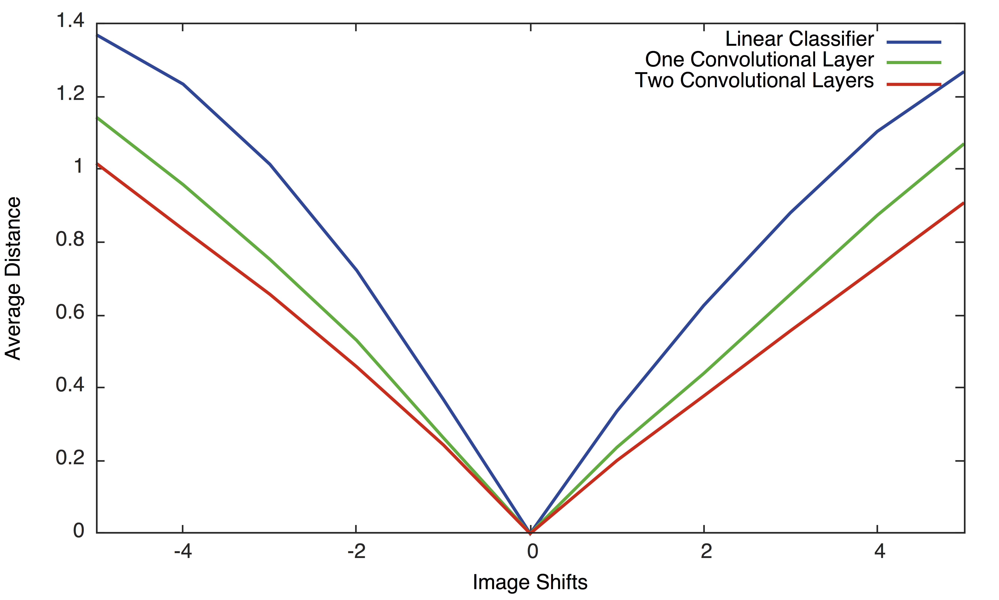

## The final project of Probabilistic Models of the Visual Cortex

The training and testing codes for the three neural networks are all implemented in CNNTrainer.lua. The help manual can be found by

```
[in]: th CNNTrainer.lua -help

[out]: Training a Convlutional Neural Network for MNIST dataset

Options:
  -numSteps max number of training steps [1000]
  -lr       learning rate [0.05]
  -net      the number of convolutional layers {0, 1, 2} [2]
  -testStep test the accuracy every testStep steps [50]
```
The output of training and testing two convolutional layer network
```
[in]: th CNNTrainer.lua -net 2
[out]:
| loading dataset
| start training
[test] | step 00050 | accuracy: 0.88400
[test] | step 00100 | accuracy: 0.91900
[test] | step 00150 | accuracy: 0.94500
[test] | step 00200 | accuracy: 0.93800
[test] | step 00250 | accuracy: 0.96500
[test] | step 00300 | accuracy: 0.96500
[test] | step 00350 | accuracy: 0.97200
[test] | step 00400 | accuracy: 0.96700
[test] | step 00450 | accuracy: 0.94800
[test] | step 00500 | accuracy: 0.96600
[test] | step 00550 | accuracy: 0.97000
[test] | step 00600 | accuracy: 0.96500
[test] | step 00650 | accuracy: 0.97100
[test] | step 00700 | accuracy: 0.96700
[test] | step 00750 | accuracy: 0.98200
[test] | step 00800 | accuracy: 0.97900
[test] | step 00850 | accuracy: 0.98400
[test] | step 00900 | accuracy: 0.98000
[test] | step 00950 | accuracy: 0.98200
[test] | step 01000 | accuracy: 0.98600
```
The output of training and testing one convolutional layer network
```
[in]: th CNNTrainer.lua -net 1
[out]:
| loading dataset
| start training
[test] | step 00050 | accuracy: 0.89100
[test] | step 00100 | accuracy: 0.91700
[test] | step 00150 | accuracy: 0.93200
[test] | step 00200 | accuracy: 0.94000
[test] | step 00250 | accuracy: 0.95300
[test] | step 00300 | accuracy: 0.96300
[test] | step 00350 | accuracy: 0.96300
[test] | step 00400 | accuracy: 0.97100
[test] | step 00450 | accuracy: 0.95700
[test] | step 00500 | accuracy: 0.96400
[test] | step 00550 | accuracy: 0.96300
[test] | step 00600 | accuracy: 0.96700
[test] | step 00650 | accuracy: 0.97000
[test] | step 00700 | accuracy: 0.96800
[test] | step 00750 | accuracy: 0.97200
[test] | step 00800 | accuracy: 0.97300
[test] | step 00850 | accuracy: 0.97400
[test] | step 00900 | accuracy: 0.97800
[test] | step 00950 | accuracy: 0.97500
[test] | step 01000 | accuracy: 0.97500
```
The output of training and testing linear classifier
```
[in]: th CNNTrainer.lua -net 0
[out]:
| loading dataset
| start training
[test] | step 00050 | accuracy: 0.85200
[test] | step 00100 | accuracy: 0.87300
[test] | step 00150 | accuracy: 0.88500
[test] | step 00200 | accuracy: 0.87700
[test] | step 00250 | accuracy: 0.89800
[test] | step 00300 | accuracy: 0.89900
[test] | step 00350 | accuracy: 0.90400
[test] | step 00400 | accuracy: 0.90600
[test] | step 00450 | accuracy: 0.89200
[test] | step 00500 | accuracy: 0.89700
[test] | step 00550 | accuracy: 0.90000
[test] | step 00600 | accuracy: 0.89800
[test] | step 00650 | accuracy: 0.90200
[test] | step 00700 | accuracy: 0.90400
[test] | step 00750 | accuracy: 0.89800
[test] | step 00800 | accuracy: 0.90100
[test] | step 00850 | accuracy: 0.90600
[test] | step 00900 | accuracy: 0.91000
[test] | step 00950 | accuracy: 0.91300
[test] | step 01000 | accuracy: 0.91200
```
To plot the learning curve
```lua
require 'gnuplot'
x = {}
for i = 50, 1000, 50 do
    table.insert(x, i)
end
y0 = {0.85200, 0.87300, 0.88500, 0.87700, 0.89800, 0.89900, 0.90400, 0.90600,
    0.89200, 0.89700, 0.90000, 0.89800, 0.90200, 0.90400, 0.89800, 0.90100,
    0.90600, 0.91000, 0.91300, 0.91200}
y1 = {0.89100, 0.91700, 0.93200, 0.94000, 0.95300, 0.96300, 0.96300, 0.97100,
    0.95700, 0.96400, 0.96300, 0.96700, 0.97000, 0.96800, 0.97200, 0.97300,
    0.97400, 0.97800,0.97500, 0.97500}
y2 = {0.88400, 0.91900, 0.94500, 0.93800, 0.96500, 0.96500, 0.97200, 0.96700,
    0.94800, 0.96600, 0.97000, 0.96500, 0.97100, 0.96700, 0.98200, 0.97900,
    0.98400, 0.98000, 0.98200, 0.98600}
x = torch.Tensor(x)
y0 = torch.Tensor(y0)
y1 = torch.Tensor(y1)
y2 = torch.Tensor(y2)
gnuplot.xlabel('Training Steps')
gnuplot.ylabel('Test Accuracy')
gnuplot.plot({'Linear Classifier', x, y0, '-'}, {'One Convolutional Layer', x,
    y1, '-'}, {'Two Convolutional Layers', x, y2, '-'})
```
The learning curves are shown as follows.


Next we demonstrate how to use ComparingInvariance.lua to evaluate the pretrained networkds.
```
[in]: th ComparingInvariance.lua -help
[out]: Comparing Invariance of the three trained networks

Options:
  -net the number of convolutional layers {0, 1, 2} [2]
```
We first evaluate the trained linear classifier
```
[in]: th ComparingInvariance.lua -net 0
[out]:
| loading the test dataset
| average distance:
| [1]   | 1.36899
| [2]   | 1.23310
| [3]   | 1.01327
| [4]   | 0.72242
| [5]   | 0.36792
| [6]   | 0.00000
| [7]   | 0.33592
| [8]   | 0.62614
| [9]   | 0.88062
| [10]  | 1.10357
| [11]  | 1.26769
```
Next we evaluate the one convolutional layer network
```
[in]: th ComparingInvariance.lua -net 1
[out]:
| loading the test dataset
| average distance:
| [1]   | 1.14268
| [2]   | 0.95751
| [3]   | 0.75228
| [4]   | 0.53026
| [5]   | 0.26268
| [6]   | 0.00000
| [7]   | 0.23673
| [8]   | 0.43956
| [9]   | 0.65670
| [10]  | 0.87340
| [11]  | 1.06983
```
Finally, we evaluate the two convolutional layer network
```
[in]: th ComparingInvariance.lua -net 2
[out]:
| loading the test dataset
| average distance:
| [1]   | 1.01600
| [2]   | 0.83485
| [3]   | 0.65654
| [4]   | 0.45781
| [5]   | 0.24308
| [6]   | 0.00000
| [7]   | 0.20050
| [8]   | 0.37763
| [9]   | 0.55655
| [10]  | 0.73132
| [11]  | 0.90802
```
To plot the average distance
```lua
require 'gnuplot'
x = {}
for i = 1, 11 do table.insert(x, i - 6) end
y2 = {1.01600, 0.83485, 0.65654, 0.45781, 0.24308, 0.00000, 0.20050, 0.37763,
    0.55655, 0.73132, 0.90802}
y1 = {1.14268, 0.95751, 0.75228, 0.53026, 0.26268, 0.00000, 0.23673, 0.43956,
    0.65670, 0.87340, 1.06983}
y0 = {1.36899, 1.23310, 1.01327, 0.72242, 0.36792, 0.00000, 0.33592, 0.62614,
    0.88062, 1.10357, 1.26769}
gnuplot.ylabel('Average Distance')
gnuplot.xlabel('Image Shifts')
x = torch.Tensor(x)
y0 = torch.Tensor(y0)
y1 = torch.Tensor(y1)
y2 = torch.Tensor(y2)
gnuplot.axis{-5,5,0,''}
gnuplot.plot({'Linear Classifier', x, y0, '-'}, {'One Convolutional Layer', x,
    y1, '-'}, {'Two Convolutional Layers', x, y2, '-'})
```
The results are shown as follows

